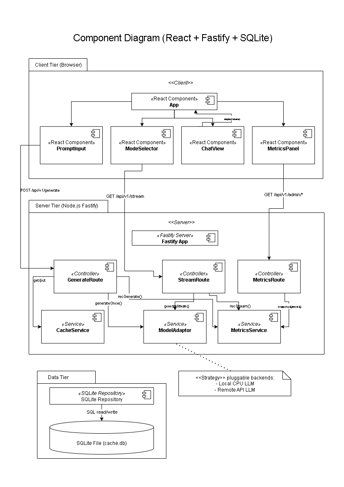

# PocketLLM Portal

> Lightweight web portal for interacting with a CPU-friendly local LLM. Built as a fully architected React + Fastify + SQLite stack with measured NFR compliance.

<p align="center">
  
  
  
  
  
  
</p>

---

## Overview

PocketLLM Portal is a portable, CPU-only LLM access layer that runs entirely on a local machine. It exposes both a synchronous **REST** completion endpoint and an asynchronous **Server-Sent Events (SSE)** streaming endpoint, backed by a SQLite cache that turns repeated prompts into sub-millisecond responses.

The project was developed across three architectural stages for USC's **CSCI-578 (Software Architecture)** course, evolving from a C4 case study through a framework-independent design to a fully implemented, measured system.

### What it does

- Accepts user prompts through a clean React UI with single-shot or streaming modes
- Returns full completions via `POST /api/v1/generate` or streams tokens via `GET /api/v1/stream` (SSE)
- Caches completions by prompt hash so repeat queries return in microseconds instead of seconds
- Tracks p50/p95/p99 latency, request counts, and cache hit-rate on an admin metrics endpoint
- Runs on a laptop. No GPU, no cloud, no external services required

---

## Architecture

The system uses a clean three-tier separation with a pluggable model backend (Strategy pattern).

### Component View



**Client Tier (Browser):** A single React `App` orchestrates four child components: `PromptInput`, `ModeSelector`, `ChatView`, and `MetricsPanel`. Network access is abstracted behind an `IFetchClient` interface that wraps the browser's native `fetch` and `EventSource` APIs.

**Server Tier (Node.js + Fastify):** A `FastifyApp` registers three route controllers (`GenerateRoute`, `StreamRoute`, `MetricsRoute`), each delegating to focused services: `CacheService`, `ModelAdapter`, `MetricsService`, and `HashingService`. The Strategy-based `ModelAdapter` lets the system swap between a local CPU LLM and a remote API LLM with zero changes to controllers.

**Data Tier:** A single `SQLiteRepository` encapsulates all SQL I/O against a local `cache.db` file. The cache key is a SHA-256 hash of the prompt plus generation parameters.

### Sequence: Single (REST) Mode

`UI → POST /api/v1/generate → CacheService.lookup → (miss) → ModelAdapter.generate → CacheService.store → JSON response`

On a cache hit, the model call is skipped entirely and the cached completion returns directly.

### Sequence: Stream (SSE) Mode

`UI → GET /api/v1/stream → SSE open → ModelAdapter.generateStream → token events → end event`

Tokens are pushed to the browser as `data:` SSE events as soon as they're produced, so time-to-first-token stays in the microsecond range.

### Other Views

Full architectural documentation is in [`docs/architecture/`](docs/architecture/):

- `logical_class_diagram.png`: Class-level structure with React components, Fastify routes, services, and the SQLite repository
- `package_diagram.png`: Folder organization (`frontend/`, `backend/routes/`, `backend/services/`, `infra/sqlite/`)
- `deployment_diagram.png`: Physical allocation across browser and Node server
- `sequence_single.png` and `sequence_stream.png`: Runtime collaboration for both modes

---

## Tech Stack

| Tier | Technology | Why |
|---|---|---|
| Frontend | React | Component-based UI, hooks for reactive state, declarative composition |
| Backend | Node.js + Fastify | Lightweight async runtime, plugin-style modularity, fast JSON serialization |
| Persistence | SQLite | Zero-config file-based store, portable, no external service needed |
| Streaming | Server-Sent Events | Native browser support, simpler than WebSockets for one-way token streams |
| Hashing | SHA-256 | Stable, collision-resistant cache keys |

---

## API Contract

| Endpoint | Method | Description |
|---|---|---|
| `/api/v1/generate` | POST | Generate a full completion. Returns JSON with completion text, cache flag, and latency |
| `/api/v1/stream?prompt=...` | GET | Stream tokens via SSE. Emits `data:` events per token and an `end` event |
| `/api/v1/admin/health` | GET | Liveness probe. Returns status and timestamp |
| `/api/v1/admin/metrics` | GET | Latency percentiles, request counts, cache hit-rate |
| `/api/v1/admin/metrics/reset` | POST | Clears in-memory metrics counters |
| `/api/v1/cache/sweep` | POST | Clears cached completion entries |

All endpoints return structured JSON errors on failure. CORS is restricted to configured frontend origins. Request bodies are capped at 8 KB.

---

## Measured Performance

Tested on Intel i7-9750H, 16 GB RAM, Windows 11, Node v22.16.0.

**Single mode latency (ms)**

| Scenario | p50 | p95 | p99 |
|---|---|---|---|
| Cache MISS | 688.5 | 1376.9 | 1376.9 |
| Cache HIT | 0.096 | 0.207 | 0.214 |

**Streaming mode latency (ms)**

| Metric | p50 | p95 | p99 |
|---|---|---|---|
| Time to first token (TTFT) | 0.083 | 0.209 | 0.209 |
| Total stream time | 687.1 | 1383.0 | 1383.0 |

Every NFR target from the requirements spec was met or exceeded. Cache hits return roughly 6,500x faster than cache misses, and SSE streaming delivers the first token in under a quarter of a millisecond.

---

## Non-Functional Requirements

The project was designed and measured against eight NFR categories:

- **Efficiency:** Latency targets met for both modes (see table above)
- **Scalability:** Supports 10 concurrent users with under 20% p95 increase, rolling metrics window of 5,000 samples
- **Portability:** Runs on Windows, macOS, and Linux with no platform-specific code
- **Adaptability:** Model backend and cache TTL are configurable via environment variables; backends are swappable via the Strategy pattern
- **Dependability:** Health uptime above 99% per hour, graceful degradation on cache failure, no crashes on malformed input
- **Security:** CORS enforcement, 8 KB request size cap, no sensitive data in logs
- **Maintainability:** Functions capped at 60 lines, nesting depth capped at 3, no cyclic dependencies, target 70% code coverage
- **Observability:** Structured JSON logs per request, p50/p95/p99 latency exposed via metrics endpoint

---

## Getting Started

### Prerequisites

- Node.js v22.16.0 or compatible
- npm 10.9.2 or compatible
- SQLite (bundled via the SQLite Node binding, no separate install needed)

### Installation

```bash
git clone https://github.com/Sreekant13/PocketLLM-Portal.git
cd PocketLLM-Portal

# Install backend dependencies
cd backend
npm install

# Install frontend dependencies
cd ../frontend
npm install
```

### Configuration

Copy `.env.sample` to `.env` in the backend folder and adjust:

```env
PORT=3001
OLLAMA_HOST=http://localhost:11434    # Ollama runtime endpoint
MODEL_ID=llama3.2:3b                  # Which Ollama-pulled model to use
CACHE_TTL_SECONDS=3600
CORS_ORIGIN=http://localhost:5173
```

The model backend uses [Ollama](https://ollama.com/) as the local LLM runtime, pluggable through the `ModelAdapter` Strategy. Make sure Ollama is running and the configured `MODEL_ID` has been pulled (`ollama pull llama3.2:3b`) before starting the backend, or use the Docker setup below which handles this automatically.

### Running

In two separate terminals:

```bash
# Terminal 1: backend
cd backend
npm run dev

# Terminal 2: frontend
cd frontend
npm run dev
```

Open `http://localhost:5173` in your browser.

### Running performance measurements

PowerShell scripts in `scripts/` reproduce the measured NFR numbers:

```powershell
.\scripts\A_metrics_install.ps1
.\scripts\B_run_measurements.ps1
```

Results land in `metrics/` as JSON and CSV plus generated charts.

---

## Run with Docker

The entire stack (Ollama + Fastify backend + React frontend) can be brought up with Docker Compose. The primary compose file builds from source; a second one is included for the case where images have been published to a registry.

| File | Purpose |
|---|---|
| `docker-compose.yml` | Builds backend and frontend images locally from their `Dockerfile`s. This is the recommended path. |
| `docker-compose.images.yml` | Pulls pre-built images from Docker Hub. Only useful if images have been published (see [Publishing your own images](#publishing-your-own-images-optional) below). |

### Prerequisites

- [Docker Desktop](https://www.docker.com/products/docker-desktop/) on Windows or macOS, or Docker Engine + Docker Compose v2 on Linux
- Roughly 4 GB of free disk space for the `llama3.2:3b` model

### Build and start

```bash
docker compose up -d --build
```

This builds the backend and frontend images from their local Dockerfiles, starts Ollama, and wires the three services together via Docker's internal DNS (the backend reaches Ollama at `http://ollama:11434`).

### First-run setup: pull the model

The Ollama container starts empty. After the stack is up, pull the model the backend expects:

```bash
docker exec -it ollama ollama pull llama3.2:3b
```

This is a one-time download (around 2 GB). The weights persist in the `ollama-data` Docker volume, so subsequent restarts skip this step.

### What gets started

| Service | URL | Purpose |
|---|---|---|
| Frontend | http://localhost:5173 | React UI |
| Backend  | http://localhost:3001 | Fastify API (REST + SSE) |
| Ollama   | http://localhost:11434 | Local LLM runtime |

The backend keeps the model resident in memory for 5 minutes after the last request (`OLLAMA_KEEP_ALIVE=5m`), so subsequent prompts skip the cold-start cost.

### Useful commands

```bash
# Stream logs from all services
docker compose logs -f

# Stop everything (keeps the model volume)
docker compose down

# Stop everything AND delete the model weights
docker compose down -v

# Rebuild after backend or frontend code changes
docker compose up -d --build backend frontend
```

### Switching models

To try a different Ollama model, update `MODEL_ID` in `docker-compose.yml`, pull the new model into the container (`docker exec -it ollama ollama pull <model>`), and restart the backend service. Any [Ollama-compatible model](https://ollama.com/library) works as long as your machine has the RAM for it.

### Publishing your own images (optional)

To make the `docker-compose.images.yml` path work for other people (or your future self on a different machine), publish the backend and frontend images to a registry. With a Docker Hub account:

```bash
# One-time: log in
docker login

# Build images with the names referenced in docker-compose.images.yml
docker compose build

# Tag the locally built images for Docker Hub
docker tag pocketllm-portal-backend  <your-dockerhub-username>/pocketllm-backend:latest
docker tag pocketllm-portal-frontend <your-dockerhub-username>/pocketllm-frontend:latest

# Push
docker push <your-dockerhub-username>/pocketllm-backend:latest
docker push <your-dockerhub-username>/pocketllm-frontend:latest
```

Once published, update the `image:` lines in `docker-compose.images.yml` to point at your username, and anyone can run the system without building locally:

```bash
docker compose -f docker-compose.images.yml up -d
```

---

## Project Structure

```
PocketLLM-Portal/
├── frontend/
│   ├── src/
│   │   ├── components/
│   │   │   ├── App.tsx
│   │   │   ├── PromptInput.tsx
│   │   │   ├── ModeSelector.tsx
│   │   │   ├── ChatView.tsx
│   │   │   └── MetricsPanel.tsx
│   │   ├── api/
│   │   │   └── FetchClient.ts
│   │   └── main.tsx
│   └── package.json
├── backend/
│   ├── src/
│   │   ├── routes/
│   │   │   ├── generate.ts
│   │   │   ├── stream.ts
│   │   │   └── metrics.ts
│   │   ├── services/
│   │   │   ├── CacheService.ts
│   │   │   ├── ModelAdapter.ts
│   │   │   ├── MetricsService.ts
│   │   │   └── HashingService.ts
│   │   ├── infra/
│   │   │   └── SQLiteRepository.ts
│   │   └── server.ts
│   ├── .env.sample
│   └── package.json
├── docs/
│   ├── architecture/      # UML diagrams (component, sequence, deployment, etc.)
│   └── reports/           # Course assignment reports
├── scripts/               # PowerShell measurement scripts
├── metrics/               # Measurement outputs (JSON, CSV, charts)
└── README.md
```

---

## Course Context

This project was developed for **CSCI-578: Software Architecture** at the University of Southern California, across three assignments:

- **Assignment 1: C4 Case Study.** Analyzed an existing system using the C4 model (Context, Container, Component, Code) and produced refined architecture diagrams.
- **Assignment 2: Framework-Independent Design.** Defined PocketLLM Portal's architecture using technology-agnostic UML views (logical, component, deployment, package, sequence) with explicit NFR targets.
- **Assignment 3: Framework-Specific Implementation.** Adapted the abstract design to a concrete React + Fastify + SQLite stack, implemented the system end-to-end, measured every NFR, and validated cross-view consistency.

Full assignment reports are preserved in [`docs/reports/`](docs/reports/).

---

## Future Work

- Authentication and per-session prompt history
- Model selection via UI (multi-backend switching at runtime)
- Distributed cache layer (Redis) for multi-instance deployments
- Optional GPU acceleration path
- WebSocket fallback for environments where SSE is blocked

---

## License

MIT License. See [LICENSE](LICENSE) for details.

---

<p align="center"><i>Built by <a href="https://github.com/Sreekant13">Sreekant Baheti</a> as part of USC's CSCI-578 Software Architecture coursework.</i></p>